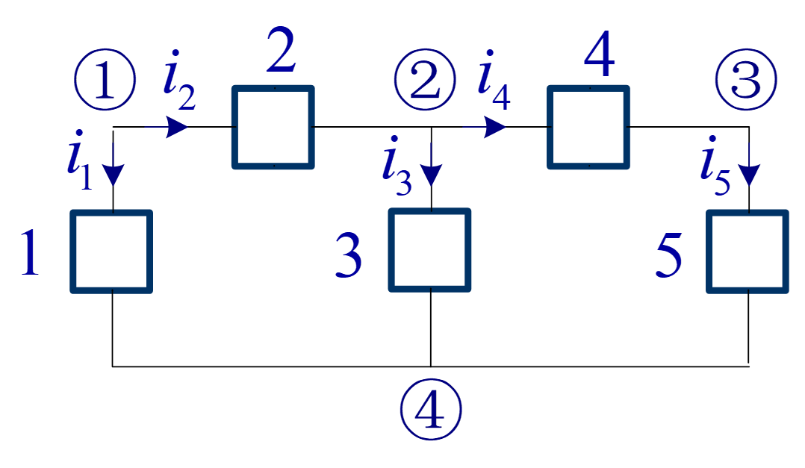
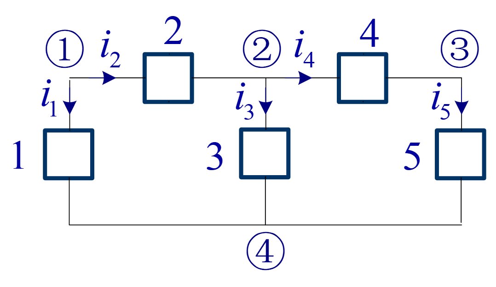

# 电路理论 (荣誉)

## 电阻电路

### 基本概念和基本规律

- 电路基本规律
- 电阻电路分析

#### 实际电路和电路模型

实际电路可以分成两类: 强电电路, 强调能量流动; 弱电电路, 强调信息流动. 电路模型是对实际电路的简化和抽象, 以便于分析和设计.

- 强电电路基本模型

```
强电源 --- 电路 --- 负载
```

- 弱电电路基本模型

```
信号源 --- 电路 --- 负载
```

电路千变万化, 电路元件千变万化, 我们需要对它们进行模型化和抽象化, 也就是**电路模型**. 电路工程实际上就是对电路模型和电路元件的分析和设计.

理想电路元件:

- 理想电压源: 电压不变, 内阻为零.
- 理想电流源: 电流不变, 内阻为无穷大.
- 理想电阻: 电阻不变, 无电感和电容.
- 理想电感: 电感不变, 无电阻和电容.
- 理想电容: 电容不变, 无电阻和电感.

**集中参数电路**: 电路元件的参数集中在一个点上, 适用于电路尺寸远小于信号波长的情况. 之所以可以把电路元件的参数集中在一个点上, 是因为电路尺寸远小于信号波长, 信号在电路中传播的时间可以忽略不计. 因此, 对于一个电路元件, 我们可以认为它的各种参数在同一时间不具有空间分布差异, 可以集中在一个点上进行分析.

考虑电路尺寸和信号波长的关系:
- 电路尺寸 << 信号波长: 集中参数电路模型适用.
   - 电磁场变化传遍整个电路所需的时间$\tau$满足$\tau << T$, 其中$T$是信号的周期.
- 电路尺寸 ~ 信号波长: 分布参数电路模型适用.
   - 电磁场变化传遍整个电路所需的时间$\tau$与信号周期$T$相当, 需要考虑电路中电磁场的空间分布.

*远远小于: $10^{-1} , 10^{-2}$*

除非额外提出, 我们都讨论集中参数电路.

分布参数电路也可以拆分成多个集中参数电路进行分析, 但这种方法不够精确, 只能作为近似分析的方法.

#### 电路变量

- 电流
- 电压
- 参考方向
- 功率等参数

基本变量: 电流, 电压, 电荷和磁通.

- 电流: 定义: $i = \frac{dq}{dt}$, 单位: 安培 (A). $I$表示直流电, $i$表示交流电.
- 电压: 定义: $v = \frac{dW}{dq}$, 单位: 伏特 (V). $V$表示直流电压, $v$表示交流电压. 也可以用电位进行定义: $v = \phi_a - \phi_b$, 其中$\phi_a$和$\phi_b$分别是电路中两点的电位. 电压的方向由高电位指向低电位. 同理, $U$表示直流电压, $u$表示交流电压.
- 参考方向: 在分析中, 对电量任意假定的方向. 用$i_{ab}$表示电流从点$a$流向点$b$的参考方向, 用$v_{ab}$表示电压从点$a$指向点$b$的参考方向.   
  参考方向和实际方向不一定一致, $+$表示参考方向和实际方向一致, $-$表示参考方向和实际方向相反. 即使不一致, 也不影响分析的正确性.   
  我们总是假设对于同一个电路元件, 电流和电压的参考方向一致, 称为**一致参考方向**. 这样可以简化分析, 避免混淆. 例如$U=IR$总是假设电流和电压的参考方向一致, 否则就需要写成$U = - IR$, 这样就不够简洁了.
- 功率: 定义: $p = iv$, 单位: 瓦特 (W). $P$表示直流功率, $p$表示交流功率. 我们采用一致参考方向, 即电流和电压的参考方向一致.
  - 当$p > 0$时, 电路元件吸收功率, 作为负载;
  - 当$p < 0$时, 电路元件提供功率, 作为电源.
  
*建议电流, 电压, 功率的参考方向要保持一致.*

#### 电路基本规律

- 元件约束(元件内部的电压电流规律)
- 拓扑约束(由电路连接方式引起的电压电流规律)
  
**术语**:
- 支路: 电路中连接两个节点的路径.
- 节点: 电路中两个或多个支路连接的点.
- 回路: 电路中一个闭合的路径.
- 网孔: 电路中一个回路, 但不包含其他回路.

**基尔霍夫电流定律 (KCL)**

**第一定律**: 对于任一集中参数电路中的任一节点, 流入该节点的电流总和等于流出该节点的电流总和.

$$\sum i_{in} = \sum i_{out}$$

**第二定律**: 对于任一集中参数电路中的任一节点, 规定流入节点的电流为正, 流出节点的电流为负, 则流入该节点的电流总和等于零.:
$$\sum_{k=1}^{n} i_k = 0$$
规定流入节点为正, 流出节点为负.



1. $i_1 + i_2 = 0$
2. $-i_2 + i_3 + i_4 = 0$
3. $-i_4 + i_5 = 0$
4. $i_1 + i_3 + i_5 = 0$

**推广**: 对于任意闭合面, 流入该面内的电流总和等于流出该面内的电流总和. 我们可以把电路中的任意联通的部分看成一个节点, 这样就可以把电路中的任意闭合面看成一个节点, 从而推广KCL.

**基尔霍夫电压定律 (KVL)**



**第一定律**: 对于任一集中参数电路中的任一回路, 升高电压的代数和等于降低电压的代数和.

$$\sum v_{rise} = \sum v_{drop}$$

**第二定律**: 对于任一集中参数电路中的任一回路, 规定电压方向和循行方向一致为正, 和循行方向相反为负, 则沿着该回路的任一方向, 电压的代数和等于零.

$$\sum v_k = 0$$

*注意参考方向必须一致, 即顺时针或者逆时针*

(由于课程节奏问题, 本部分笔记终止, 我会在期中复习的时候呈现完整的知识梳理)